# 1.4 Instalación de zonas secundarias con Windows Server.

### 1. Tomaremos a máquina benskywalker, e configuraremola para ser servidor secundario, tanto da zona primaria academia.jedi de resolución directa como de resolución inversa. Captura a configuración en ambalas dúas máquinas.
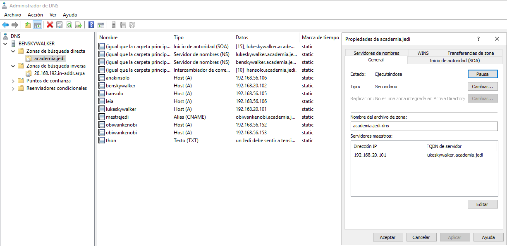

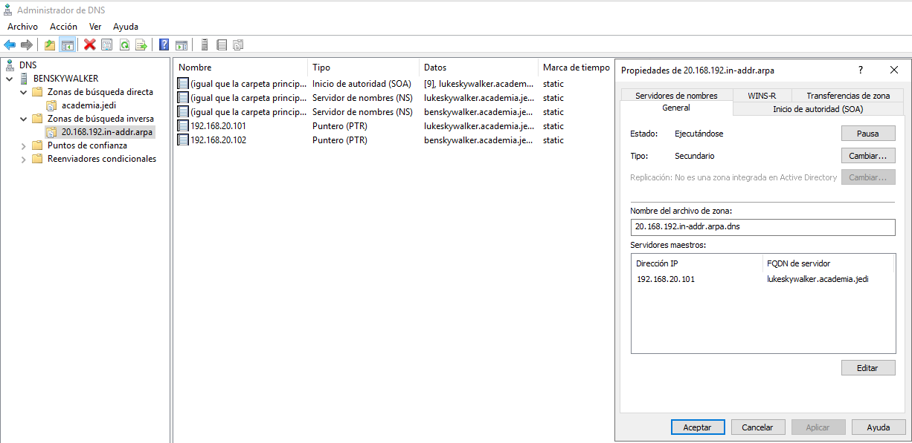

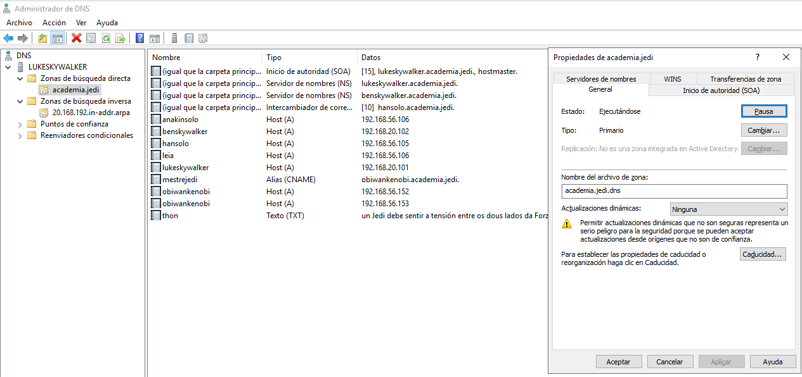

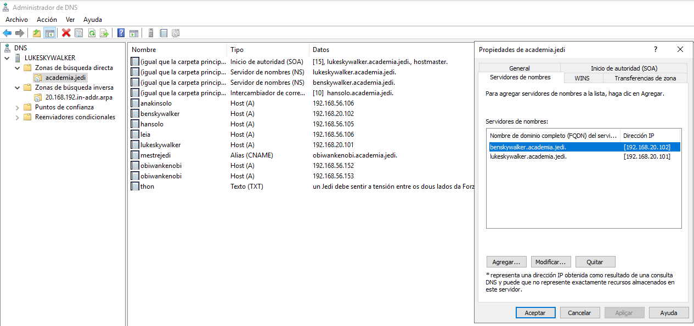

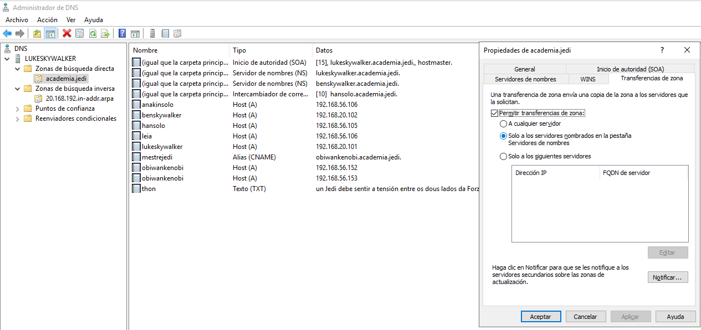

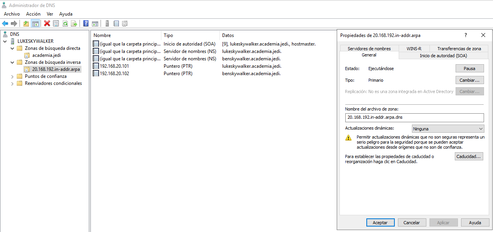

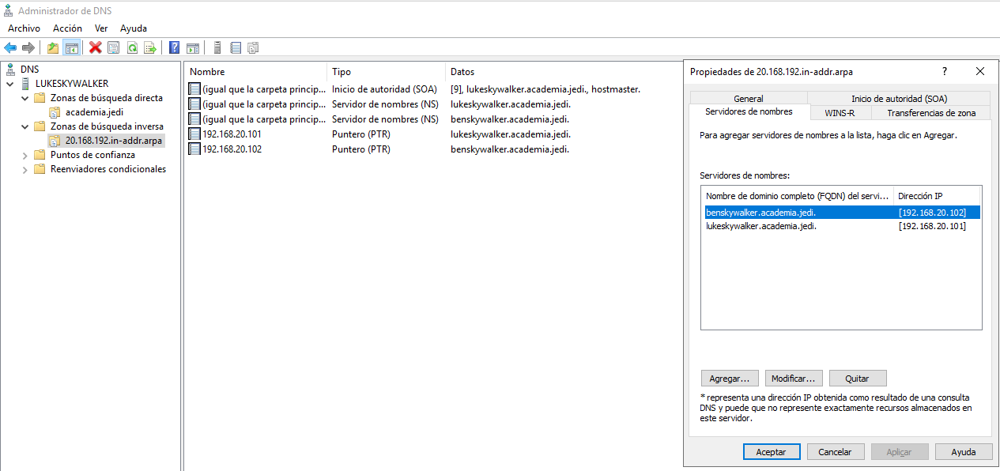

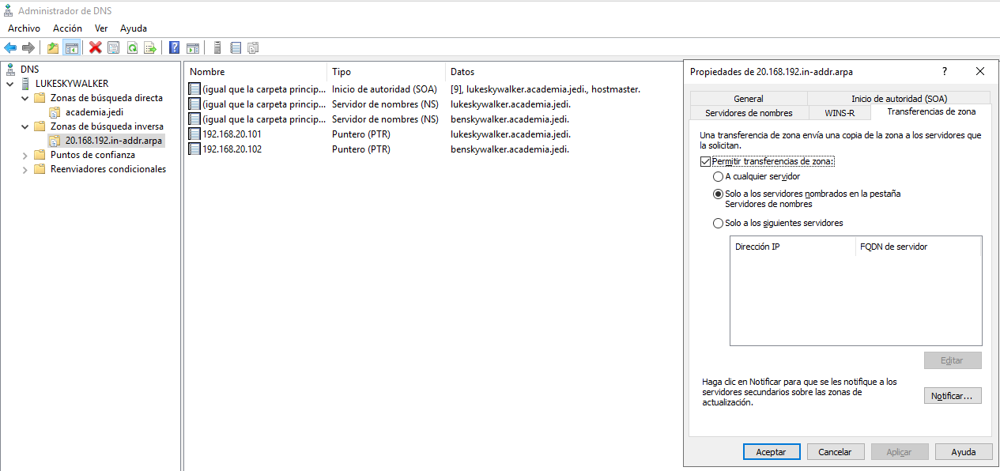

### 2. Engade un rexistro tipo A (yaddle 192.168.20.107) na zona de resolución directa e tamén na de resolución inversa. Adxunta captura dos rexistros da zona unha vez feita a transferencia.
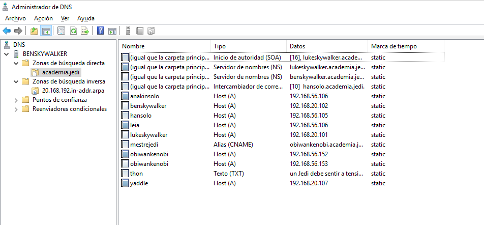

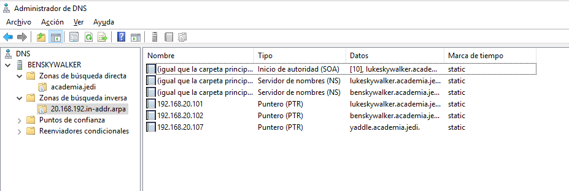
### 3. Fai que no equipo benswkywalker  se atope unha copia da zona starwars.lan, transferida desde darthvader.
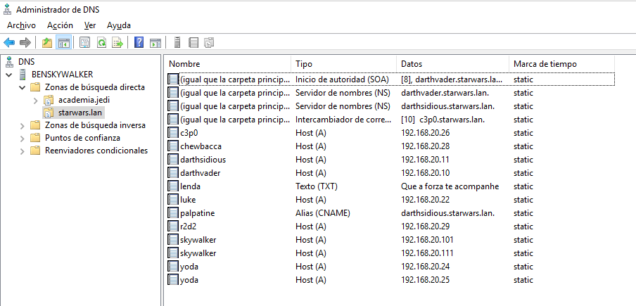

### 4. Fai que no equipo darthsidious se atope unha copia da zona academia.jedi transferida desde lukeskywalker.

